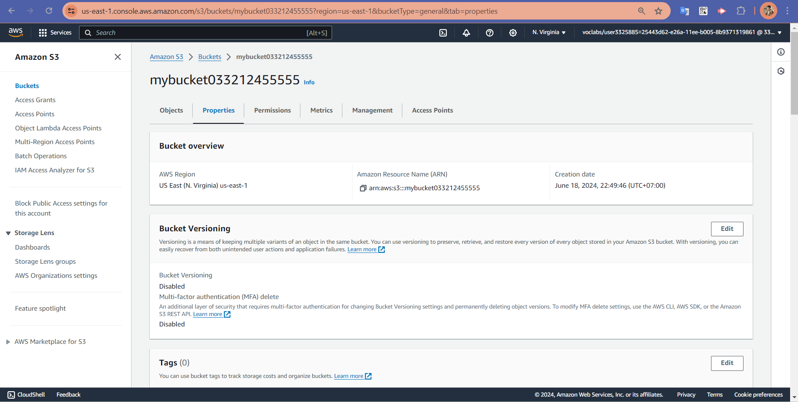

# Full-Stack Application Deployment Documentation

## 1. Configure Needed Infrastructure for a Web Application

### Criteria:
- AWS RDS for the database
- AWS Elastic Beanstalk (or alternatives like Lambda) for the API
- AWS S3 for web hosting
- The app is accessible via the link provided.

### Evidence:
- **AWS RDS Setup:**

    

- **AWS Elastic Beanstalk Setup:**

    

- **AWS S3 Setup:**

    

- **Application Link:** [http://mybucket033212455555.s3-website-us-east-1.amazonaws.com](http://mybucket033212455555.s3-website-us-east-1.amazonaws.com)

## 2. CircleCI Configuration for Continuous Integration

### Criteria:
- Trigger a successful pipeline on each push to the main branch.
- A build status badge is present in the README.md, indicating the current state of the main branch build.
- Write a proper pipeline file using the config.yml format used by CircleCI.
- Configure secrets via the Continuous Integration software.

### Evidence:
- **CircleCI Last Build Screenshot:**

    

- **Build Status Badge:**

    ```markdown
    
    ```
- **CircleCI Environment Variables Configuration Screenshot:**

    

## 3. Documenting Deployment Process

### Criteria:
- A documentation folder should include separate pages on different topics that cannot be discovered by just quickly glancing at code.

### Evidence:
- **Documentation Folder Structure:**

    

### Criteria:
- Prepare an architecture diagram to document the deployment flow.

### Evidence:
- **High-Level Infrastructure Diagram:**

    

- **Pipeline Overview Diagram:**

    

## Conclusion

This document provides a comprehensive overview of the steps taken to deploy the full-stack application, ensuring a robust, secure, and well-documented deployment process.

---